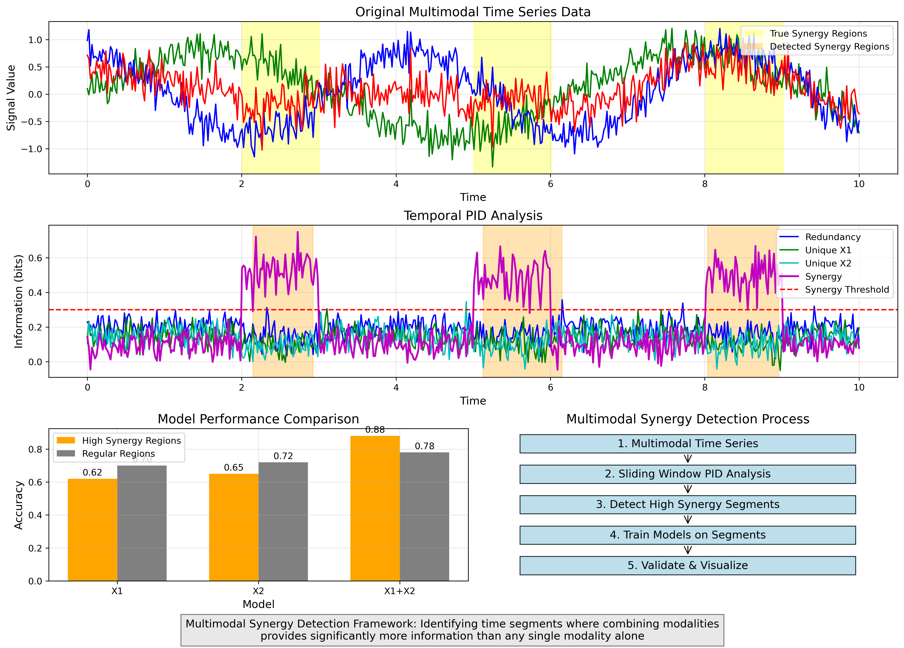

# Multimodal Synergy Detection Framework

This README describes a framework for detecting time segments where multimodal synergy is highest, validating these insights with machine learning models, and visualizing the results.

## Files in this Framework

1. **multimodal_synergy_detector.py** - Main implementation file with the multimodal synergy detection algorithm
2. **minimal_synergy_detector.py** - Simplified version for demonstration purposes
3. **multimodal_synergy_diagram.py** - Script to generate visual explanation of the approach
4. **README_multimodal_synergy_detector.md** - This documentation file

## Conceptual Overview

### Problem Statement
When combining multiple data modalities (e.g., video and audio, EEG and fMRI, etc.), we need to identify specific time periods where the combination of modalities provides significantly more information than any single modality alone.

### Solution Approach
The framework leverages temporal Partial Information Decomposition (PID) to decompose the total information provided by two source modalities (X1, X2) about a target variable (Y) into four components:
- **Redundancy**: Information shared between both modalities
- **Unique X1**: Information provided only by modality X1
- **Unique X2**: Information provided only by modality X2
- **Synergy**: Information that can only be obtained by combining both modalities

## Visual Explanation



The diagram above illustrates the multimodal synergy detection process:
1. **Top panel**: Original multimodal time series with true synergy regions highlighted in yellow
2. **Middle panel**: Temporal PID analysis showing redundancy, unique information, and synergy components over time
3. **Bottom left**: Model performance comparison showing improved accuracy when using combined modalities in high synergy regions
4. **Bottom right**: Step-by-step process flow of the synergy detection framework

## Implementation Components

### 1. Time-Window Analysis
- Apply a sliding window approach to detect temporal changes in synergy
- For each window:
  - Extract data from both modalities and the target
  - Calculate temporal PID components using the `temporal_pid` function
  - Record redundancy, unique information, and synergy values
  - Mark windows with synergy above a threshold as "high-synergy segments"

```python
# Conceptual code for window analysis
for i in range(0, n_samples - window_size, stride):
    start_idx = i
    end_idx = i + window_size
    
    # Extract window data
    X1_window = X1[start_idx:end_idx]
    X2_window = X2[start_idx:end_idx]
    Y_window = Y[start_idx:end_idx]
    
    # Calculate temporal PID
    pid = temporal_pid(X1_window, X2_window, Y_window, lag=1, bins=5)
    
    # Record components
    synergy = pid['synergy']
    if synergy > threshold:
        high_synergy_segments.append((start_idx, end_idx, synergy))
```

### 2. Model Validation
- Build models using different combinations of modalities:
  - Model_X1: Using only X1
  - Model_X2: Using only X2
  - Model_X1X2: Using both X1 and X2
- Train and evaluate these models on:
  - High-synergy segments
  - Low-synergy segments (or all other segments)
- Compare performance to validate that combined modalities indeed perform better in high-synergy regions

```python
# Conceptual code for model validation
def validate_synergy_insights(X1, X2, Y, high_synergy_segments):
    # Extract data from high synergy segments
    high_synergy_indices = get_indices_from_segments(high_synergy_segments)
    X1_high = X1[high_synergy_indices]
    X2_high = X2[high_synergy_indices]
    Y_high = Y[high_synergy_indices]
    
    # Train and evaluate models
    model_X1 = train_model(X1_high, Y_high)
    model_X2 = train_model(X2_high, Y_high)
    model_X1X2 = train_model(np.column_stack([X1_high, X2_high]), Y_high)
    
    # Compare performance
    # Expected: model_X1X2 significantly outperforms model_X1 and model_X2
    # in high synergy regions, but not in low synergy regions
```

### 3. Visualization
- Plot PID components across time to show temporal dynamics
- Highlight detected high-synergy regions and compare to ground truth
- Visualize model performance comparisons to validate insights

```python
# Conceptual code for visualization
plt.figure(figsize=(14, 10))

# Plot PID components
plt.subplot(3, 1, 1)
plt.plot(time_points, redundancy_values, 'b-', label='Redundancy')
plt.plot(time_points, unique_x1_values, 'g-', label='Unique X1')
plt.plot(time_points, unique_x2_values, 'r-', label='Unique X2')
plt.plot(time_points, synergy_values, 'm-', label='Synergy')

# Highlight high synergy regions
plt.subplot(3, 1, 2)
for start, end, _ in high_synergy_segments:
    plt.axvspan(start, end, color='yellow', alpha=0.3)

# Plot model performance comparison
plt.subplot(3, 1, 3)
plt.bar(['X1', 'X2', 'X1X2'], [x1_accuracy, x2_accuracy, x1x2_accuracy])
```

## Potential Applications

1. **Multimodal Healthcare**:
   - Identify critical time periods in patient monitoring where combining multiple sensors provides synergistic information
   - Optimize when to use more expensive/invasive modalities based on synergy detection

2. **Brain-Computer Interfaces**:
   - Detect moments when combining EEG, fMRI, or other brain imaging modalities provides synergistic insights
   - Build adaptive BCI systems that use multiple modalities only when beneficial

3. **Multimodal Learning**:
   - Create efficient multimodal deep learning systems that dynamically adjust which modalities to use
   - Reduce computational costs by using multiple modalities only during high-synergy periods

4. **Robotics and Autonomous Systems**:
   - Enable robots to intelligently combine sensor data only when synergistic
   - Improve decision-making in dynamic environments by identifying when sensor fusion is most valuable

## Technical Implementation

The full implementation would use:
1. `temporal_pid.py` from the existing codebase for information-theoretic calculations
2. Sliding window analysis to detect temporal changes in synergy
3. Machine learning models to validate insights
4. Visualization tools to display results

The approach can be applied to any time series data with multiple modalities, as long as:
- The modalities can be synchronized in time
- There is a clear target variable or outcome to predict
- The temporal dynamics are of interest

## References

- Williams, P. L., & Beer, R. D. (2010). Nonnegative decomposition of multivariate information. arXiv preprint arXiv:1004.2515.
- Lizier, J. T., & Prokopenko, M. (2010). Differentiating information transfer and causal effect. The European Physical Journal B, 73(4), 605-615.
- Wibral, M., Priesemann, V., Kay, J. W., Lizier, J. T., & Phillips, W. A. (2017). Partial information decomposition as a unified approach to the specification of neural goal functions. Brain and cognition, 112, 25-38.